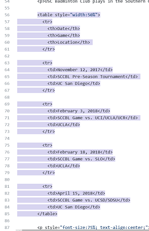

# uscbadminton.github.io
USC Badminton website, created 21 December 2017 by @kelly0501 and built from scratch.

**Features to Implement**
- Add access to database in order for members to reserve courts
- 15 min [timer](https://www.w3schools.com/howto/howto_js_countdown.asp) on courts
- Special case for challenge court signups
- Can't signup if already on waitlist/on court
- Allow people to add themselves to MailChimp mailing list (core feature implemented 28 December 2017 using MailChimp signup form editor)
- Add instructional section so that future club officers can easily change information
- Clicking the logo header to return to home (use `a href`)
- Tidy up Contact/[Social Media icons](https://www.w3schools.com/howto/howto_css_social_media_buttons.asp)
- Can change navbar to `<header>` tag

**Current known issues to fix**  
- updated 26 January 2018
- ~~whitespace still exists above the navigation bar~~
- ~~navigation bar is static but page body floats above it~~ use `z-index` CSS property
- ~~"USC Badminton" `id="logo_text"` is floating behind the navigation bar instead of below it when the page loads~~
- limitation of validation through JavaScript however user can disable front-end JavaScript so that they can enter anything they want into fields

**What to Update Every Semester**
- Practice schedule
- Game schedule
- Lyon Center hours

**How to change logo**  
**How to change game schedule (via GitHub)** 
1. Navigate to the uscbadminton.github.io repository on GitHub 
2. Open "game_schedule.html"
3. Find the pencil icon to edit the file  

4. Find the `<table>` tag and its corresponding `<\table>` in the code editor  

**Moving data between Google Sheets and Firebase (via `firebase-import`)**
1. On your Google Sheet, go to File > Download As... > Comma-Separated Values (.csv)
2. sfsd

**Moving data between Google Sheets and Firebase (via GoogleScript Sync)**
1. Follow [this tutorial](https://www.sohamkamani.com/blog/2017/03/09/sync-data-between-google-sheets-and-firebase/)

**Implementing 15-Min Timer**
- I think this can only be done by modifying the countdown timer tutorial listed above
- save [`Date.getDay()`](https://developer.mozilla.org/en-US/docs/Web/JavaScript/Reference/Global_Objects/Date/getDay) or any of the [`Date.toString()`](https://developer.mozilla.org/en-US/docs/Web/JavaScript/Reference/Global_Objects/Date/toDateString) methods into a JavaScript variable and alter it to local time to get the current time
- Have `if` statements for to check what day it is using `getDay()` (i.e. just check if it is a practice day)
- Set another `Date()` object as the time to countdown to
	- Ex. If practice is 6-9pm for the practice day, have the initial countdown time set to 6:15pm
- Have another `if` statement compare the time to the countdown time
- If the time is after the countdown time but before the end of practice, increment countdown time by 15 min and compare the times again
	- Ex. Practice is 6-9pm today and it is now 6:32pm. The initial value of countdown time was 6:15pm on today's date.
	- 6:32pm is a valid time to be playing but it is past 6:15pm on today's date. Increment (a.k.a. change the value of) the countdown variable to 6:30pm.
	- Check again. 6:32pm is a valid time to be playing but it is past 6:30pm. Increment the countdown variable to 6:45pm
	- Check again. It's not 6:45pm yet so go to next step
- If we haven't reached the countdown time and it's before the end of practice, show the timer from the tutorial
	- Ex. Continuing with 6:32pm example and counting down to 6:45pm, the timer will show that there are 13 minutes left to play for this round

